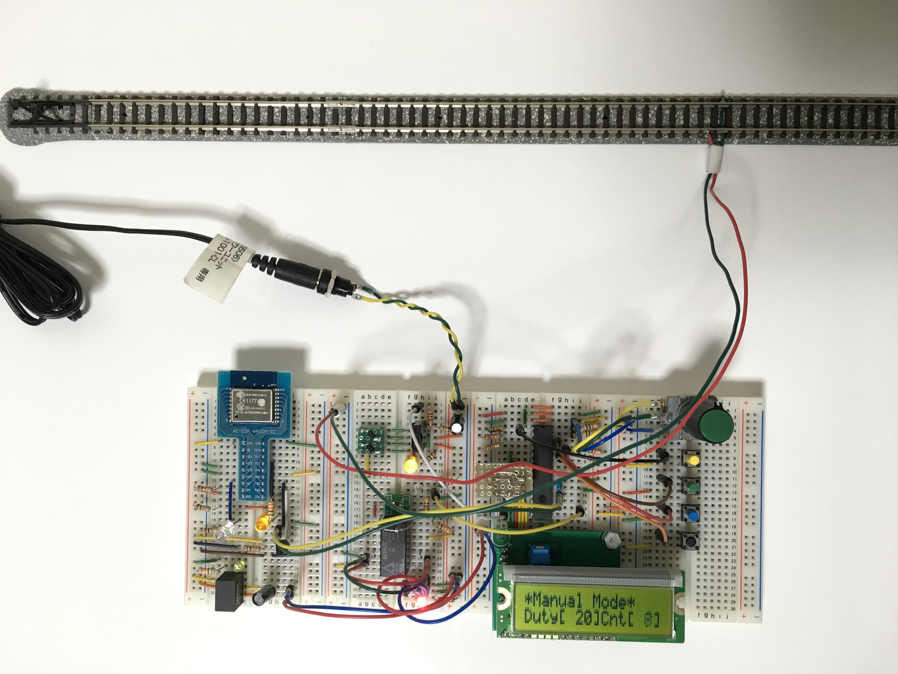
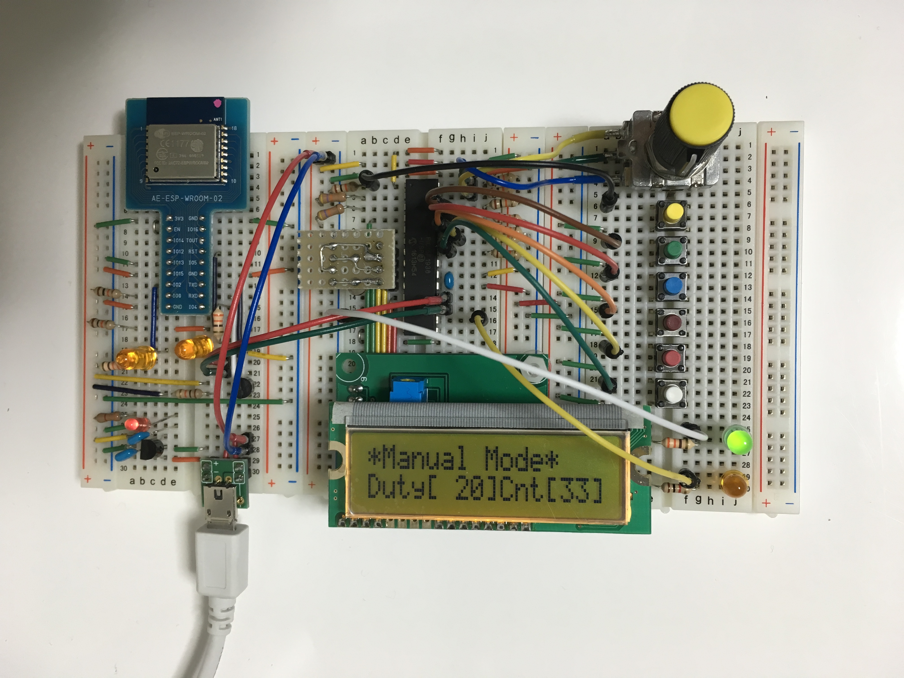

# RMWiFiController

## 概要

鉄道模型のレイアウト上（または近く）に配置したコントローラーを、手元のリモコンで操作する装置です。

## 構成

大きく分けるとパワーコントローラー部、リモコン部からなります。

これらに、Wi-Fiモジュールをそれぞれ搭載させ、制御データを同期させています。

基本的に内部機能は同一なので、コードは共用してます。

### コントローラー基板

リモコンからのリモート制御用信号を、Wi-Fiモジュール（Arduino）で受けます。

PICマイコン（PIC16F1938。以下同）で、指定されたDuty比をもとにPWM信号を生成し、パワーMOSFETをドライブして駆動電圧を生成してます。

Duty比はリモコン基板でも、コントローラー基板上のつまみでも、どちらでも調整が可能です。

### リモコン基板

リモコン基板上のつまみで、Duty比を調整し、Wi-Fiモジュール（Arduino）からコントローラー基板へ送信します。

ただし、コントローラー基板と同じファームを使用しているので、ここでもPWM信号が生成され、その電圧でLEDを点灯させています（すなわちDuty比の大小でLEDが明るくなったり暗くなったりします）。

## 回路

EAGLE で作成したものを公開しております。

まだ、実体配線図は作成途上ですが、回路図はブレッドボードの実験回路にて動作を確認済みです。

## 機能

2017/04/22現在、機能を再編成中です。

現在は下記機能のみの提供となります。

(1) 基板上のつまみ（ロータリーエンコーダー）で、フィーダーから供給する動力電圧を制御

(2) 基板上のボタン（タクトスイッチ）で、フィーダーの極性（正転／反転）を切替え

### 将来追加予定の機能

(1) ボタン運転 - 基板上に用意した専用ボタンを押すたびに、加速（-->あらかじめ決めておいた最高動力で定速走行）-->減速（-->停止ぎりぎりの動力で走行）-->停止、の流れで運転することができる機能です。

(2) ダイヤ運転 - あらかじめ用意した運転条件／運転間隔で、ボタン運転と同じ流れの運転が実行できる機能です。

(3) 条件設定 - 上記ボタン運転／ダイヤ運転の条件（諸々のパラメーター）を、液晶ディスプレイをみながら設定／変更できる機能です。
